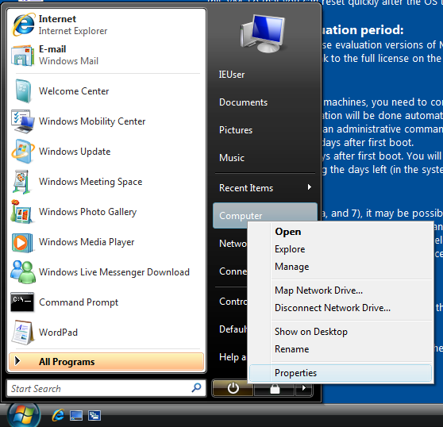
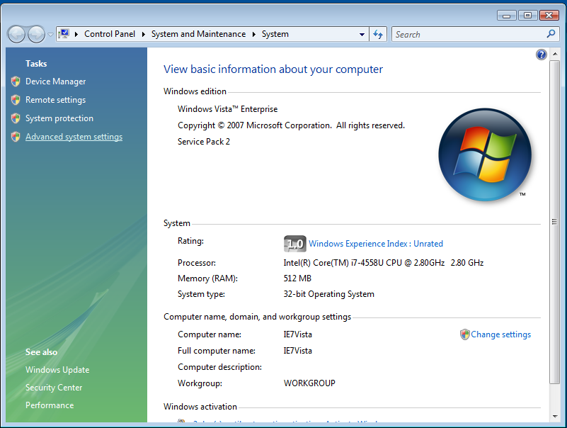
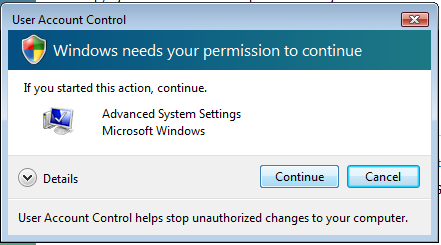
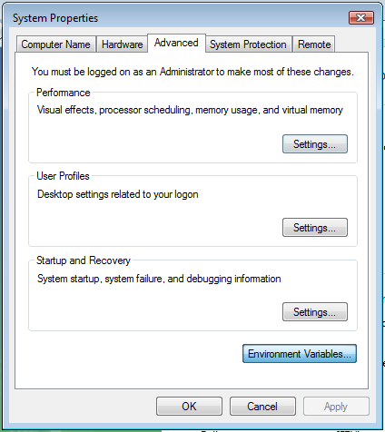
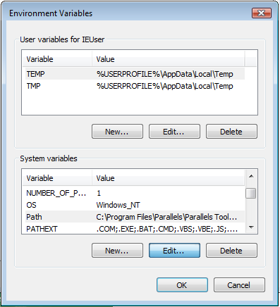
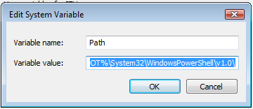

Windowsで環境変数のPATHを追加する方法沢山
=============================

# まとめ

Windows 2000、XPまではマイコンピューターの右クリックから設定を開始する。

Windows 7以降はコンパネのシステムとセキュリティ〜から設定を開始する。

VistaはXPと7の中間。

# 普段から環境変数を頻繁に書き換えてる人は

[RapidEE](http://www.rapidee.com/en/about)などのツールを使うと捗ると思います。

# setxコマンドをつかってコマンドラインから設定（Vista以降）

setxコマンドがWindows Vista以降では使える（XP以前にはない（らしいが未調査））
これはコマンドラインから永続的な設定が一発で行えるために非常に便利である。

具体的には以下のように指定する。

```
SETX /M PATH "%PATH%;c:\xampp\php"
```

管理者権限で実行する必要があるので、コマンドプロンプト（cmd.exe）を以下のようにして起動する。


コマンドプロンプトのアイコンを右クリックして管理者で実行（スクリーンショットはWindows8、7以下はスタートメニューから）


pathコマンドで現在のパスを確認（一応なので、作業としては不要、ウッカリ消したときに戻すためにメモしたほうがよい。cmdでは右クリックからマークで選択、Enterでコピーできる。ペーストも右クリックから）


設定コマンドを入力し、実行する。


コマンドプロンプトを再度立ち上げ直して反映されていることを確認する。


もし管理者権限のないユーザーで実行すると、「エラー：レジストリパスへのアクセスが拒否されました。」などと出力されます。


# Windows 2000

マイコンピューターを右クリックしてプロパティを開く


詳細タブの環境変数ボタンをクリックする


環境変数設定画面が開くので、システム環境変数の変数名「Path」を選択し、編集ボタンを押す。
（この辺りは多少個人の好みもあるとおもいますが、今回は最短でいきます）


「システム変数の編集」というダイアログがでるので、変数値を編集する。
この時、目的のパスが「c:\xampp\php\」ならば、最後に「;c:\xampp\php\」などと追加する。（セミコロンを頭につける）
既存をまちがってけしたりしたら、キャンセルする。

問題がなければ、OKをおして保存する。コマンドプロンプトをあたらしくひらいて、実際に必要なプログラムを実行してみてパスが通っているか確認する。
「path」というコマンドでも確認できる。


# Windows XP


スタートメニューを押し、マイコンピューターを右クリックしてプロパティを開く


システムのプロパティが開くので、詳細設定タブを開き、環境変数ボタンを押す


環境変数設定画面が開くので、システム環境変数の変数名「Path」を選択し、編集ボタンを押す。
（この辺りは多少個人の好みもあるとおもいますが、今回は最短でいきます）


「システム変数の編集」というダイアログがでるので、変数値を編集する。
この時、目的のパスが「c:\xampp\php\」ならば、最後に「;c:\xampp\php\」などと追加する。（セミコロンを頭につける）
既存をまちがってけしたりしたら、キャンセルする。

問題がなければ、OKをおして保存する。コマンドプロンプトをあたらしくひらいて、実際に必要なプログラムを実行してみてパスが通っているか確認する。
「path」というコマンドでも確認できる。


# Windows Vista
(英語版ですが、画面構成は同じなので、適当に読み替えてください)
冒頭で紹介したSETXをつかわないGUIの設定は以下の通り



スタートメニューを押し、マイコンピューターを右クリックしてプロパティを開く



左下のシステムの詳細設定を開く



UACのダイアログがでるので、許可する



システムのプロパティの詳細設定タブ、環境変数ボタンを押す



環境変数設定画面が開くので、システム環境変数の変数名「Path」を選択し、編集ボタンを押す。
（この辺りは多少個人の好みもあるとおもいますが、今回は最短でいきます）



「システム変数の編集」というダイアログがでるので、変数値を編集する。
この時、目的のパスが「c:\xampp\php\」ならば、最後に「;c:\xampp\php\」などと追加する。（セミコロンを頭につける）
既存をまちがってけしたりしたら、キャンセルする。

問題がなければ、OKをおして保存する。コマンドプロンプトをあたらしくひらいて、実際に必要なプログラムを実行してみてパスが通っているか確認する。
「path」というコマンドでも確認できる。


# Windows 7
(英語版ですが、画面構成は同じなので、適当に読み替えてください)
冒頭で紹介したSETXをつかわないGUIの設定は以下の通り


スタートメニューをクリックして、コントロールパネルを開く。


システムとセキュリティをひらく


システムをひらく


左下のシステムの詳細設定を開く


システムのプロパティの詳細設定タブ、環境変数ボタンを押す


環境変数設定画面がひらくので、システム環境変数の、変数名「Path」を選択し、編集ボタンを押す。
（この辺りは多少個人の好みもあるとおもいますが、今回は最短でいきます）


「システム変数の編集」というダイアログがでるので、変数値を編集する。
この時、目的のパスが「c:\xampp\php\」ならば、最後に「;c:\xampp\php\」などと追加する。（セミコロンを頭につける）
既存をまちがってけしたりしたら、キャンセルする。

問題がなければ、OKをおして保存する。コマンドプロンプトをあたらしくひらいて、実際に必要なプログラムを実行してみてパスが通っているか確認する。
「path」というコマンドでも確認できる。


# Windows 8
冒頭で紹介したSETXをつかわないGUIの設定は以下の通り


スタートメニューをクリックして、コントロールパネルを開く。


システムとセキュリティをひらく


システムをひらく


左下のシステムの詳細設定を開く


システムのプロパティの詳細設定タブ、環境変数ボタンを押す


環境変数設定画面がひらくので、システム環境変数の、変数名「Path」を選択し、編集ボタンを押す。
（この辺りは多少個人の好みもあるとおもいますが、今回は最短でいきます）


「システム変数の編集」というダイアログがでるので、変数値を編集する。
この時、目的のパスが「c:\xampp\php\」ならば、最後に「;c:\xampp\php\」などと追加する。（セミコロンを頭につける）
既存をまちがってけしたりしたら、キャンセルする。

問題がなければ、OKをおして保存する。コマンドプロンプトをあたらしくひらいて、実際に必要なプログラムを実行してみてパスが通っているか確認する。
「path」というコマンドでも確認できる。


# （定型文）

Microsoft、Windows、Windows 2000、Windows Vista、Windows 7、Windows 8、Windows Server 2012、Windows Server またはその他のマイクロソフト製品の名称および製品名は、米国Microsoft Corporationの米国およびその他の国における商標または登録商標です。

# 本ドキュメントのライセンス

（「スクリーンショット」というものが引用にできるのかわからぬが）

本文の部分はMITです。

# 謝辞

@hajime さん
@r_ohki さん
@hondallica さん

情報ありがとうございました！！
