Windowsで環境変数のPATHを追加する方法沢山
=============================

# まとめ

Windows 2000、XPまではマイコンピューターの右クリックからいける。

Windows 7以降はコンパネのシステムとセキュリティ〜からいける。

Windows Vistaがないので検証できていない。（どなたか〜）

pull req ウエルカム、特にVista

# 普段から滅茶苦茶環境変数書き換えてる人は

[RapidEE](http://www.rapidee.com/en/about)などのツールを使うと捗ると思います。

# setxコマンドをつかってコマンドラインから設定

setxコマンドがWindows Vista以降では使える（XP以前にはない（らしいが未調査））

```
SETX /M PATH "%PATH%;c:\xampp\php"
```

を管理者権限で実行する事で可能、スクショ的には以下の通り。


コマンドプロンプトを右クリックして管理者で実行

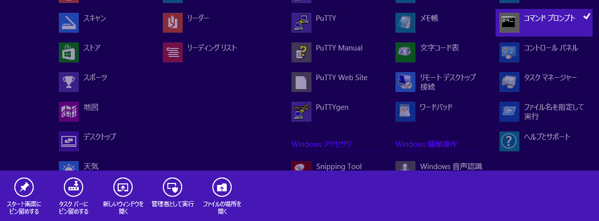
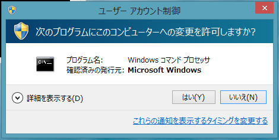

pathコマンドで現在のパスを確認（一応なので、不要、ウッカリ消したときに戻すのには必要？）

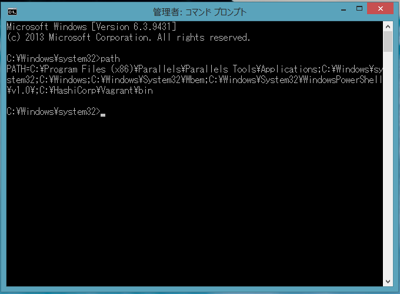

コマンドを入力し、実行

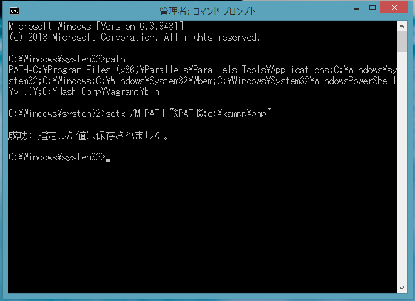

コマンドプロンプトを立ち上げ直して反映されていることを確認する。

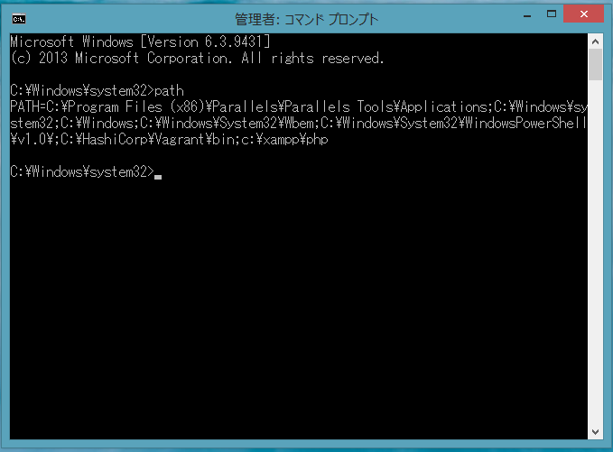

管理者権限のないユーザーで実行すると、「エラー：レジストリパスへのアクセスが拒否されました。」などと出力されます


# Windows 2000

マイコンピューターを右クリックしてプロパティを開く

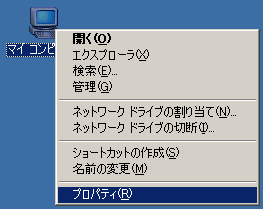

詳細タブの環境変数ボタンをクリックする

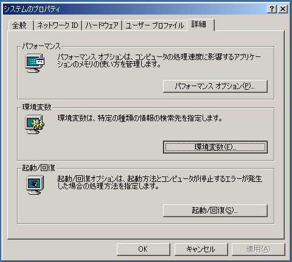

環境変数設定画面がひらくので、（この辺りは多少個人の好みもあるとおもうが、今回は最短でいきます）システム環境変数の、変数名「Path」を選択し、編集ボタンを押す。

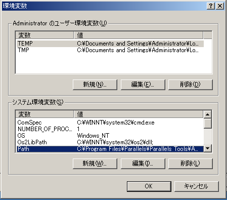

「システム変数の編集」というダイアログがでるので、変数値を編集する。
この時、目的のパスが「c:\xampp\php\」ならば、最後に「;c:\xampp\php\」などと追加する。（セミコロンを頭につける）
既存をまちがってけしたりしたら、キャンセルする。


# Windows XP

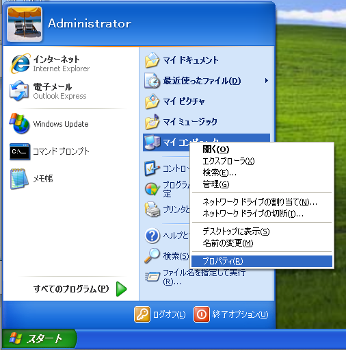

スタートメニューを押し、マイコンピューターを右クリックしてプロパティを開く

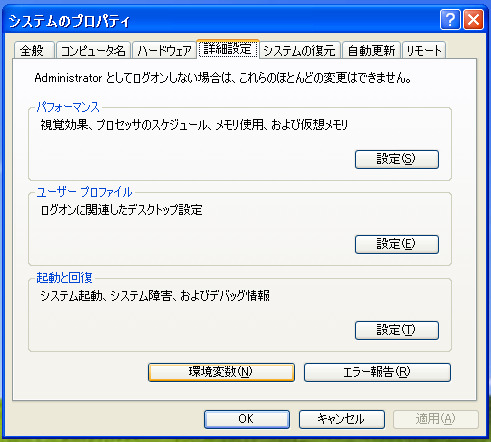

システムのプロパティが開くので、詳細設定タブを開き、環境変数ボタンを押す

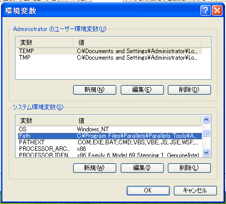

環境変数設定画面がひらくので、（この辺りは多少個人の好みもあるとおもうが、今回は最短でいきます）システム環境変数の、変数名「Path」を選択し、編集ボタンを押す。

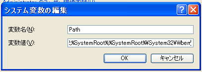

「システム変数の編集」というダイアログがでるので、変数値を編集する。
この時、目的のパスが「c:\xampp\php\」ならば、最後に「;c:\xampp\php\」などと追加する。（セミコロンを頭につける）
既存をまちがってけしたりしたら、キャンセルする。

問題がなければ、OKをおして保存する。コマンドプロンプトをあたらしくひらいて、パスが通っているか確認する。
「path」というコマンドでも確認できる。


# Windows 7 / ThinPC (英語版ですまぬ）

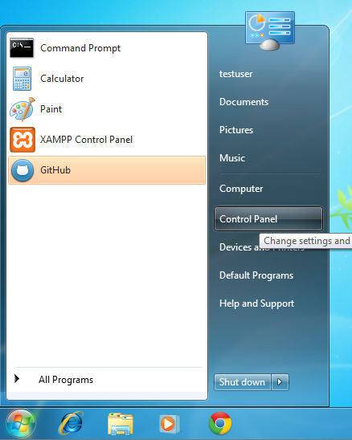

スタートメニューをクリックして、コントロールパネルを開く。

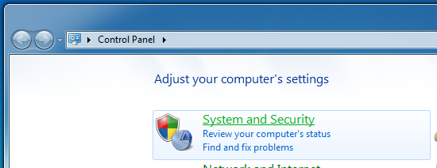

システムとセキュリティをひらく

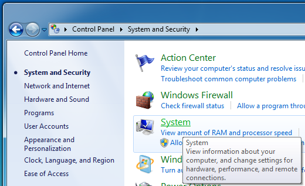

システムをひらく

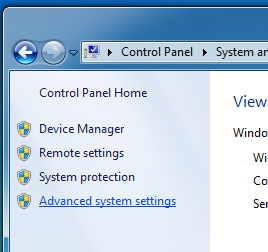

左下のシステムの詳細設定を開く

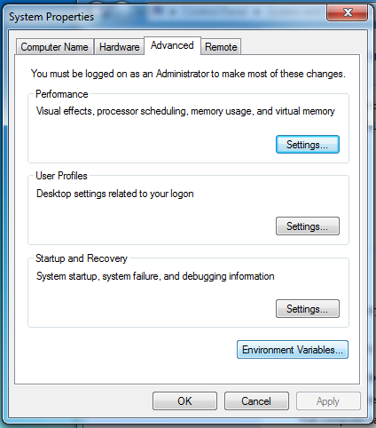

システムのプロパティの詳細設定タブ、環境変数ボタンを押す

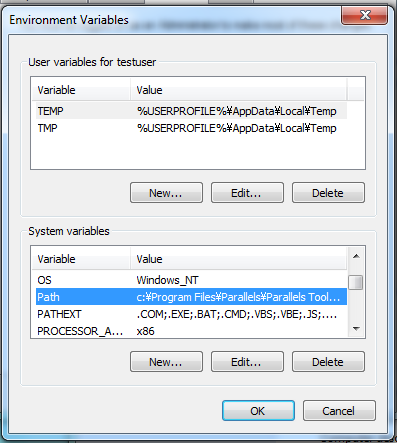

環境変数設定画面がひらくので、（この辺りは多少個人の好みもあるとおもうが、今回は最短でいきます）システム環境変数の、変数名「Path」を選択し、編集ボタンを押す。

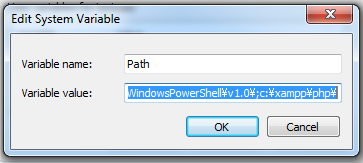

「システム変数の編集」というダイアログがでるので、変数値を編集する。
この時、目的のパスが「c:\xampp\php\」ならば、最後に「;c:\xampp\php\」などと追加する。（セミコロンを頭につける）
既存をまちがってけしたりしたら、キャンセルする。

問題がなければ、OKをおして保存する。コマンドプロンプトをあたらしくひらいて、パスが通っているか確認する。
「path」というコマンドでも確認できる。

# Windows 8

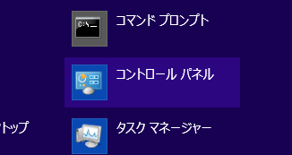

スタートメニューをクリックして、コントロールパネルを開く。

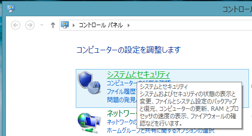

システムとセキュリティをひらく

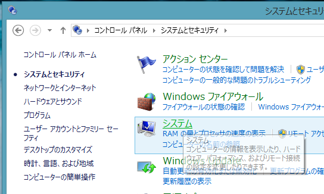

システムをひらく

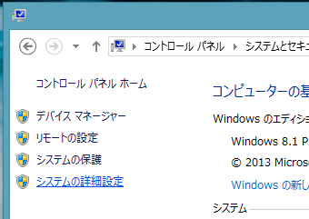

左下のシステムの詳細設定を開く

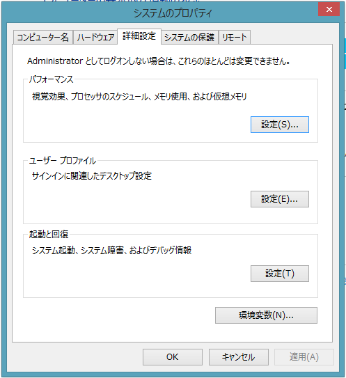

システムのプロパティの詳細設定タブ、環境変数ボタンを押す

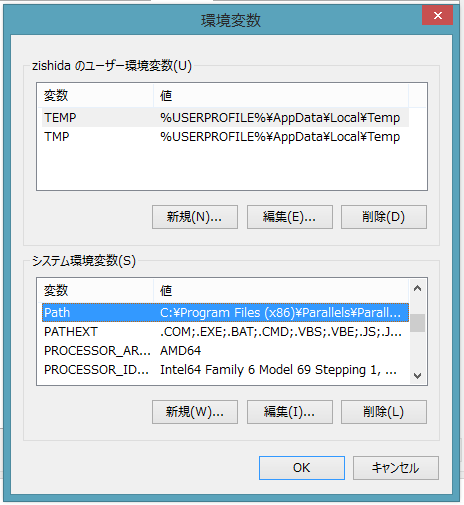

環境変数設定画面がひらくので、（この辺りは多少個人の好みもあるとおもうが、今回は最短でいきます）システム環境変数の、変数名「Path」を選択し、編集ボタンを押す。

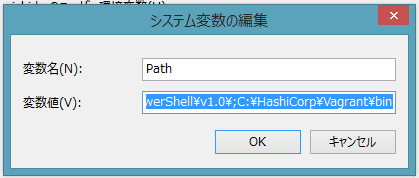

「システム変数の編集」というダイアログがでるので、変数値を編集する。
この時、目的のパスが「c:\xampp\php\」ならば、最後に「;c:\xampp\php\」などと追加する。（セミコロンを頭につける）
既存をまちがってけしたりしたら、キャンセルする。

問題がなければ、OKをおして保存する。コマンドプロンプトをあたらしくひらいて、パスが通っているか確認する。
「path」というコマンドでも確認できる。


# （定型文）

Microsoft、Windows、Windows 2000、Windows Vista、Windows 7、Windows 8、Windows Server 2012、Windows Server またはその他のマイクロソフト製品の名称および製品名は、米国Microsoft Corporationの米国およびその他の国における商標または登録商標です。

# 本ドキュメントのライセンス

（「スクリーンショット」というものが引用にできるのかわからぬが）

本文の部分はMITです。
